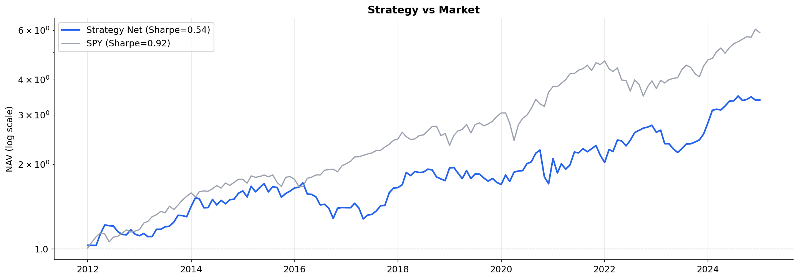
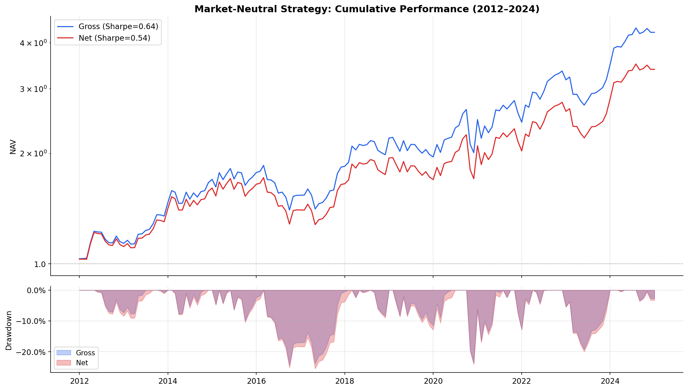
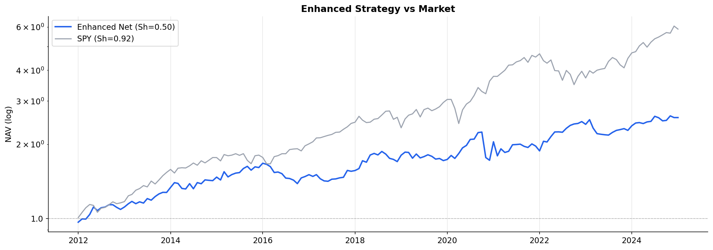
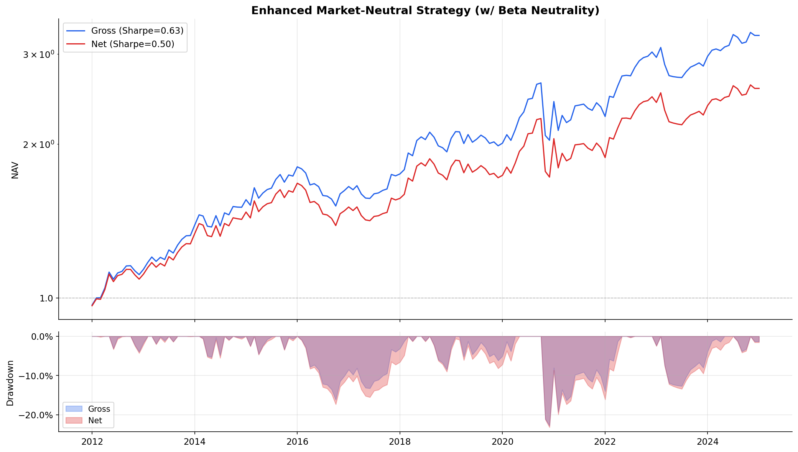
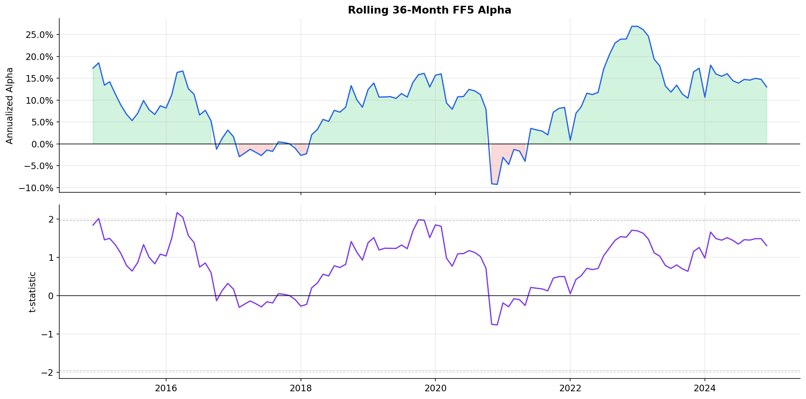
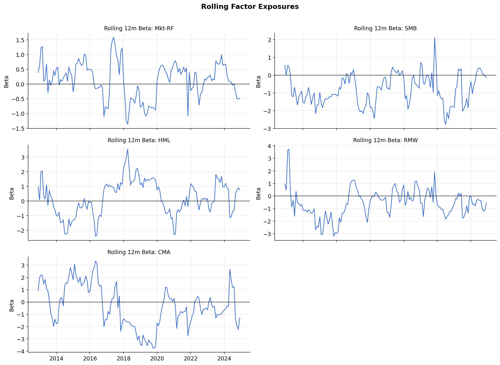

# Modern Multi-Factor Market Neutral Equity Strategy for S&P 500

A comprehensive quantitative finance research project that implements a **multi-factor market-neutral equity strategy** on the S&P 500 universe. The project spans the full quantitative investment pipeline — from raw data acquisition through factor engineering, risk modeling, portfolio optimization, to high-fidelity backtesting and performance attribution.

---

## Table of Contents

- [Project Overview](#project-overview)
- [Key Features](#key-features)
- [Project Pipeline](#project-pipeline)
- [Repository Structure](#repository-structure)
- [Data Pipeline & Outputs](#data-pipeline--outputs)
- [Methodology](#methodology)
  - [Phase 1: Data Acquisition & Preprocessing](#phase-1-data-acquisition--preprocessing)
  - [Phase 2: Factor Engineering](#phase-2-factor-engineering)
  - [Phase 3: Risk Modeling & Portfolio Optimization](#phase-3-risk-modeling--portfolio-optimization)
  - [Phase 4: Backtesting & Performance Attribution](#phase-4-backtesting--performance-attribution)
- [Results](#results)
- [Requirements](#requirements)
- [Usage](#usage)
- [License](#license)

---

## Project Overview

This project constructs a **dollar-neutral, sector-balanced long/short equity portfolio** using three classic alpha factors (Value, Size, Momentum), applying modern quantitative techniques at each stage:

- **Fama-MacBeth cross-sectional regressions** to extract pure factor returns
- **Factor Risk Parity (FRP)** for dynamic factor weighting
- **PCA-based statistical risk model** for covariance estimation
- **Convex optimization** with turnover penalty and realistic constraints
- **Fama-French 5-Factor attribution** to isolate genuine alpha

**Universe**: S&P 500 constituents (survivorship-bias-free)  
**Backtest Period**: 2010–2024 (monthly rebalancing)  
**Data Source**: CRSP & Compustat via WRDS

---

## Key Features

| Feature | Description |
|---|---|
| **Survivorship-Bias-Free** | Full price history for all stocks ever included in S&P 500, including delisted securities |
| **Point-in-Time Discipline** | All fundamental data aligned via `rdq` with 45-day delay from `datadate` — no look-ahead bias |
| **Intra-Sector Standardization** | Z-scores computed within `date × GICS sector` groups using MAD winsorization |
| **Pure Factor Returns** | Fama-MacBeth (1973) procedure orthogonalizes factor contributions |
| **Dynamic Factor Weighting** | Factor Risk Parity ensures equal marginal risk contribution across factors |
| **PCA Risk Model** | Stratified core selection → PCA → universe regression → full covariance matrix |
| **Convex Optimizer** | CVXPY-based with dollar neutrality, sector balance, turnover penalty, leverage limits |
| **Enhanced Constraints** | Beta neutrality, factor exposure limits, tighter diversification requirements |
| **Realistic Transaction Costs** | Commission + market impact + borrow cost model |

---

## Project Pipeline

```
Phase 1: Data Acquisition & Preprocessing
  │   HFS_Project_Data_Fetcher_0304.ipynb
  │
  ├──► sp500_price_panel_with_delist.csv.gz    (daily price panel, 871 stocks)
  ├──► sp500_monthly_returns.csv.gz            (monthly compounded returns)
  └──► sp500_monthly_signals_rebuilt_nodvmt.csv.gz  (Value & Size signals)
          │
Phase 2 Task 2.1: Momentum Factor Construction
  │   HFS_Phase2_Momentum.ipynb
  │
  └──► sp500_monthly_signals_3factor.csv.gz    (3-factor panel: Value, Size, Momentum)
          │
Phase 2 Task 2.2: Cross-Sectional Regression (Fama-MacBeth)
  │   HFS_Phase2_Task2_2_CrossSectionalRegression.ipynb
  │
  └──► sp500_pure_factor_returns.csv.gz        (monthly pure factor returns)
          │
Phase 2 Task 2.3/2.4: FRP & Expected Returns
  │   HFS_Phase2_Task2_3_FRP_and_ExpectedReturns.ipynb
  │
  ├──► sp500_frp_weights.csv.gz                (dynamic factor weights)
  └──► sp500_expected_returns.csv.gz           (expected return vector μ(i,t))
          │
Phase 3 Task 3.1: PCA Risk Model
  │   HFS_Phase3_Task3_1_PCA_RiskModel.ipynb
  │
  └──► sp500_risk_model.pkl                    (β, Ω_f, Λ_ε components)
          │
Phase 3 Task 3.2: Convex Portfolio Optimizer
  │   HFS_Phase3_Task3_2_Optimizer.ipynb
  │
  ├──► sp500_portfolio_weights.csv.gz          (optimal weights ω*(i,t))
  └──► sp500_backtest_results.csv.gz           (NAV, returns, turnover)
          │
Phase 3 Task 3.3: Enhanced Optimizer (stricter constraints)
  │   HFS_Phase3_Task3_3_Enhanced_Optimizer_Phase4.ipynb
  │
  ├──► sp500_portfolio_weights_enhanced.csv.gz
  └──► sp500_backtest_results_enhanced.csv.gz
          │
Phase 4: Backtest & Performance Attribution
  │   HFS_Phase4_Task3_2_Backtest_Attribution.ipynb
  │
  └──► Performance reports & visualizations (figures/)
```

---

## Repository Structure

```
├── README.md
├── Project_Proposal_SP500 Market Neutral.pdf
│
├── HFS_Project_Data_Fetcher_0304.ipynb        # Phase 1: Data acquisition from WRDS
├── HFS_Phase2_Momentum.ipynb                  # Phase 2.1: Momentum factor construction
├── HFS_Phase2_Task2_2_CrossSectionalRegression.ipynb  # Phase 2.2: Fama-MacBeth regression
├── HFS_Phase2_Task2_3_FRP_and_ExpectedReturns.ipynb   # Phase 2.3-2.4: FRP & expected returns
├── HFS_Phase3_Task3_1_PCA_RiskModel.ipynb     # Phase 3.1: PCA risk model
├── HFS_Phase3_Task3_2_Optimizer.ipynb         # Phase 3.2: Convex portfolio optimizer
├── HFS_Phase3_Task3_3_Enhanced_Optimizer_Phase4.ipynb  # Phase 3.3: Enhanced constraints
├── HFS_Phase4_Task3_2_Backtest_Attribution.ipynb       # Phase 4: Backtesting & attribution
│
├── data/                                      # All intermediate and final datasets
│   ├── csv/                                   # Uncompressed CSV backups
│   ├── parquet_backup/                        # Parquet format backups
│   ├── F-F_Research_Data_5_Factors_2x3_daily.CSV  # Fama-French 5-factor daily data
│   ├── sp500_price_panel_with_delist.csv.gz   # Daily price panel (2008-2024)
│   ├── sp500_monthly_returns.csv.gz           # Monthly compounded returns
│   ├── sp500_monthly_signals_3factor.csv.gz   # 3-factor exposure panel
│   ├── sp500_pure_factor_returns.csv.gz       # Pure factor return time series
│   ├── sp500_frp_weights.csv.gz               # FRP dynamic factor weights
│   ├── sp500_expected_returns.csv.gz          # Expected return vectors
│   ├── sp500_risk_model.pkl                   # PCA risk model components
│   ├── sp500_portfolio_weights.csv.gz         # Baseline portfolio weights
│   ├── sp500_portfolio_weights_enhanced.csv.gz # Enhanced portfolio weights
│   ├── sp500_backtest_results.csv.gz          # Baseline backtest results
│   ├── sp500_backtest_results_enhanced.csv.gz # Enhanced backtest results
│   └── sp500_risk_model_diagnostics.csv       # Risk model diagnostic metrics
│
├── figures/                                   # Baseline strategy visualizations
│   ├── nav_drawdown.png                       # NAV curve & drawdown analysis
│   ├── strategy_vs_spy.png                    # Strategy vs S&P 500 comparison
│   ├── rolling_alpha.png                      # Rolling alpha analysis
│   ├── factor_exposures.png                   # FF5 factor exposure decomposition
│   ├── long_short_legs.png                    # Long/short leg attribution
│   ├── monthly_returns.png                    # Monthly return distribution
│   └── portfolio_characteristics.png          # Portfolio characteristics over time
│
├── figures_enhanced/                          # Enhanced strategy visualizations
│   ├── nav_drawdown_enhanced.png
│   ├── strategy_vs_spy_enhanced.png
│   ├── rolling_alpha_enhanced.png
│   ├── long_short_enhanced.png
│   └── characteristics_enhanced.png
│
└── archived/                                  # Archived/outdated notebooks
```

---

## Methodology

### Phase 1: Data Acquisition & Preprocessing

**Notebook**: `HFS_Project_Data_Fetcher_0304.ipynb`

- Fetches S&P 500 constituent history, daily prices/returns, and quarterly fundamentals from **WRDS** (CRSP + Compustat)
- Constructs **survivorship-bias-free** daily price panel (871 stocks, 2008–2024)
- Computes monthly compounded returns with **delisting adjustment**
- Builds **Value** (0.67·Z(Earnings Yield) + 0.33·Z(Price-to-Book)) and **Size** (−Z(Market Cap)) factor signals
- All Z-scores are **intra-sector MAD-winsorized** to ensure cross-sector comparability

### Phase 2: Factor Engineering

#### Task 2.1 — Momentum Factor (`HFS_Phase2_Momentum.ipynb`)

- Implements **Jegadeesh & Titman (1993)** momentum: cumulative return over months [t-12, t-2]
- Skips the most recent month to avoid short-term reversal contamination
- Intra-sector Z-score standardization consistent with Value and Size
- Produces complete 3-factor monthly signal panel

#### Task 2.2 — Cross-Sectional Regression (`HFS_Phase2_Task2_2_CrossSectionalRegression.ipynb`)

- **Fama-MacBeth (1973)** procedure: monthly cross-sectional OLS of excess returns on factor exposures
- Extracts **pure factor returns** $\tilde{f}_t = (\beta'\beta)^{-1}\beta' x_t$
- Computes Fama-MacBeth t-statistics to test factor premium significance
- Validates against Fama-French 5 factors (HML, SMB correlation checks)

#### Task 2.3/2.4 — Factor Risk Parity & Expected Returns (`HFS_Phase2_Task2_3_FRP_and_ExpectedReturns.ipynb`)

- **Factor Risk Parity (FRP)**: dynamic weights ensuring equal Marginal Risk Contribution across factors
- Rolling covariance estimation on pure factor returns → PCA → risk decomposition
- Expected return generation: $\mu(i,t) = \sum_k w_k^{FRP}(t) \cdot Z_k(i,t)$, scaled by cross-sectional volatility

### Phase 3: Risk Modeling & Portfolio Optimization

#### Task 3.1 — PCA Risk Model (`HFS_Phase3_Task3_1_PCA_RiskModel.ipynb`)

- **Stratified core selection**: ~55 stocks from 11 GICS sectors via market-cap stratification
- **PCA decomposition**: 3–15 principal components capturing ~90% variance
- **Universe regression**: OLS of all ~600 stocks on PC returns → factor loadings and idiosyncratic variance
- **Covariance reconstruction**: $\Sigma = \beta \Omega_f \beta' + \Lambda_\varepsilon$

#### Task 3.2 — Convex Portfolio Optimizer (`HFS_Phase3_Task3_2_Optimizer.ipynb`)

- **CVXPY** convex optimization: $\max_w \; \mu'w - \lambda \cdot w'\Sigma w - \kappa \cdot \|w - w_{prev}\|_1$
- **Constraints**: dollar neutrality ($\sum w = 0$), gross leverage limit, position bounds, sector balance
- Monthly rebalancing with **turnover penalty** for realistic implementation

#### Task 3.3 — Enhanced Optimizer (`HFS_Phase3_Task3_3_Enhanced_Optimizer_Phase4.ipynb`)

| Enhancement | Baseline | Enhanced |
|---|---|---|
| Beta Neutrality | Not enforced | \|β_mkt · w\| ≤ 0.05 |
| Diversification | w_max = 5%, ~50 positions | w_max = 2%, ~100+ positions |
| Gross Leverage | 2.0 | 2.5 |
| Factor Neutrality | None | SMB/HML exposure constraints |

### Phase 4: Backtesting & Performance Attribution

**Notebook**: `HFS_Phase4_Task3_2_Backtest_Attribution.ipynb`

- **Realistic transaction cost model**: commission (2 bps) + market impact (Almgren model) + borrow cost (50 bps annualized for shorts)
- **Fama-French 5-Factor regression**: isolates alpha from MktRF, SMB, HML, RMW, CMA exposures
- **Rolling analysis**: 12-month rolling alpha, beta, information ratio
- **Drawdown analysis**: maximum drawdown, recovery periods, stress-test decomposition
- **Long/short leg attribution**: separate performance analysis for long and short portfolios

---

## Results

### Baseline Strategy Performance



### Enhanced Strategy Performance



### Factor Attribution



---

## Requirements

### Python Environment

```
python >= 3.9
numpy
pandas
scipy
statsmodels
scikit-learn
cvxpy
matplotlib
seaborn
```

### Data Access

- **WRDS account** is required to run the data fetcher notebook (`HFS_Project_Data_Fetcher_0304.ipynb`)
- Pre-processed data files are included in the `data/` directory, so subsequent notebooks can be run without WRDS access

### Install Dependencies

```bash
pip install numpy pandas scipy statsmodels scikit-learn cvxpy matplotlib seaborn
```

or with conda:

```bash
conda install numpy pandas scipy statsmodels scikit-learn matplotlib seaborn
conda install -c conda-forge cvxpy
```

---

## Usage

The notebooks are designed to be executed **sequentially**. Each notebook reads outputs from previous phases and produces intermediate datasets for downstream tasks.

```bash
# 1. Data fetching (requires WRDS credentials)
jupyter notebook HFS_Project_Data_Fetcher_0304.ipynb

# 2. Factor engineering
jupyter notebook HFS_Phase2_Momentum.ipynb
jupyter notebook HFS_Phase2_Task2_2_CrossSectionalRegression.ipynb
jupyter notebook HFS_Phase2_Task2_3_FRP_and_ExpectedReturns.ipynb

# 3. Risk model & optimization
jupyter notebook HFS_Phase3_Task3_1_PCA_RiskModel.ipynb
jupyter notebook HFS_Phase3_Task3_2_Optimizer.ipynb

# 4. Backtesting & attribution
jupyter notebook HFS_Phase4_Task3_2_Backtest_Attribution.ipynb

# (Optional) Enhanced optimizer with stricter constraints
jupyter notebook HFS_Phase3_Task3_3_Enhanced_Optimizer_Phase4.ipynb
```

> **Note**: If the pre-processed data files already exist in `data/`, you can start from any phase without re-running earlier notebooks.

---

## License

This project is for academic and educational purposes. The data is sourced from WRDS (CRSP & Compustat) and Fama-French Data Library, subject to their respective terms of use.
